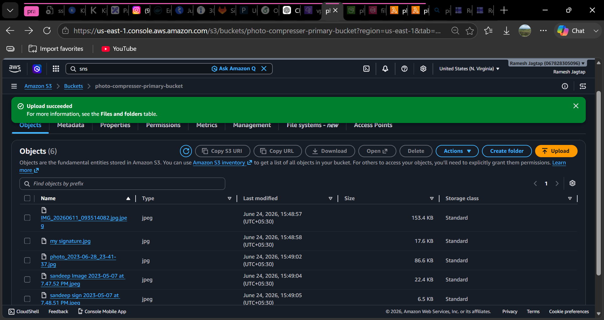
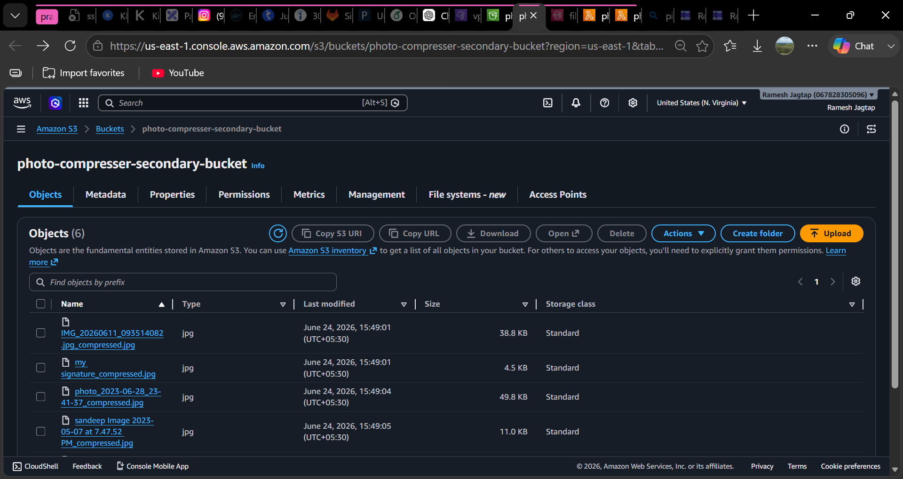
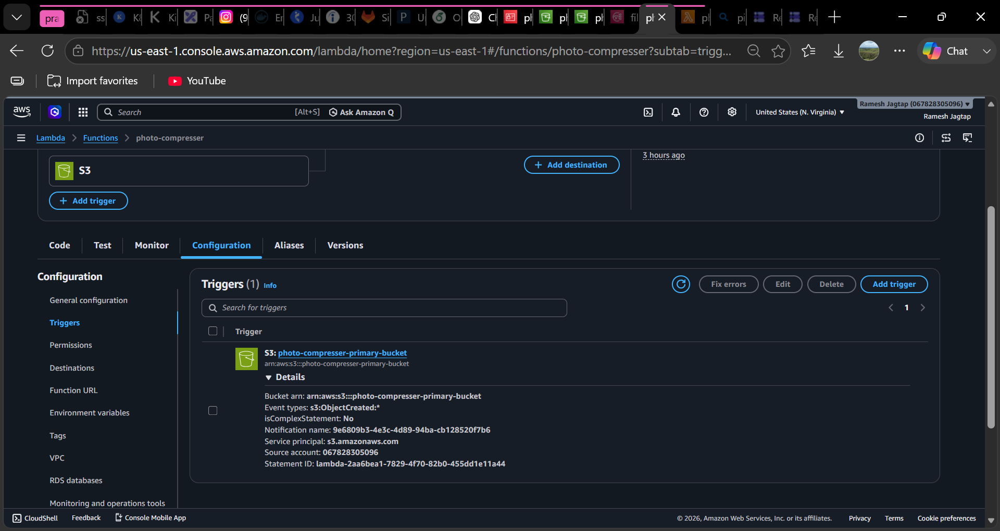
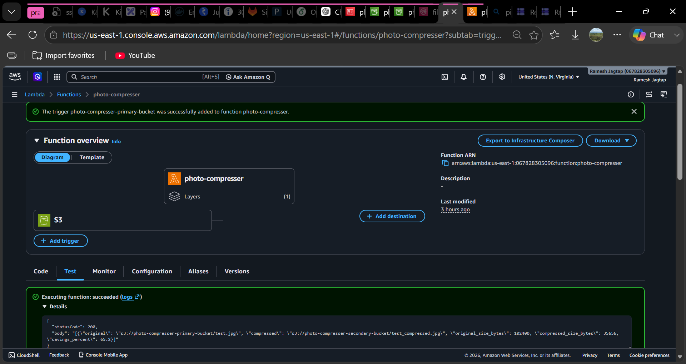

# Photo Compressor - AWS Serverless Image Compression

## Introduction

Photo Compressor is a serverless image compression solution built on AWS. Whenever an image is uploaded to an Amazon S3 bucket, an AWS Lambda function automatically compresses the image using the Pillow library, stores the optimized version in a separate S3 bucket, and sends a notification through Amazon SNS.

This project demonstrates event-driven architecture, serverless computing, image processing, and AWS service integration.

---

## Architecture Diagram

```text
                Upload Image
                      |
                      v
        +---------------------------+
        | Primary S3 Bucket         |
        | photo-compresser-primary  |
        +---------------------------+
                      |
                      | S3 Trigger
                      v
        +---------------------------+
        | AWS Lambda                |
        | photo-compressor          |
        +---------------------------+
                      |
        +-------------+-------------+
        |                           |
        v                           v

+------------------+     +------------------+
| Secondary Bucket |     | Amazon SNS       |
| Compressed Image |     | Notification     |
+------------------+     +------------------+
```

---

## Tech Stack

### AWS Services

- AWS Lambda
- Amazon S3
- Amazon SNS
- AWS IAM
- Amazon CloudWatch

### Programming Language

- Python 3.12

### Libraries

- Pillow
- Boto3

### Lambda Layer

```text
arn:aws:lambda:us-east-1:770693421928:layer:Klayers-p312-pillow:2
```

---

## Steps to Deploy

### Step 1: Create Source and Destination S3 Buckets

Create the following buckets:

```text
photo-compresser-primary-bucket
photo-compresser-secondary-bucket
```

#### Source Bucket



#### Destination Bucket



---

### Step 2: Create SNS Topic

Create an SNS topic named:

```text
file-compressed
```

#### SNS Topic Configuration


---

### Step 3: Create Lambda Function

Create a Lambda function with the following configuration:

```text
Runtime: Python 3.12
Function Name: photo-compressor
```

Upload the Lambda code and configure the handler.

---

### Step 4: Add Pillow Layer

Attach the following Lambda Layer:

```text
arn:aws:lambda:us-east-1:770693421928:layer:Klayers-p312-pillow:2
```

This layer provides the Pillow library required for image processing.

---

### add this block in Test -> Event JSON 

```
{
  "Records": [
    {
      "s3": {
        "bucket": {
          "name": "photo-compresser-primary-bucket"
        },
        "object": {
          "key": "test.jpg",
          "size": 102400
        }
      }
    }
  ]
}

```
### Step 5: Configure IAM Permissions

Attach the following policies to the Lambda execution role:

```text
AmazonS3FullAccess
AmazonSNSFullAccess
AWSLambdaBasicExecutionRole
```

#### IAM Role Permissions


---

### Step 6: Configure Environment Variables

Add the following environment variables:

```text
RAW_BUCKET=photo-compresser-primary-bucket
COMPRESSED_BUCKET=photo-compresser-secondary-bucket
SNS_TOPIC_ARN=<your-sns-topic-arn>
JPEG_QUALITY=60
MAX_WIDTH=1920
MAX_HEIGHT=1080
```

---

### Step 7: Configure S3 Trigger

Add an S3 trigger to invoke the Lambda function whenever an image is uploaded.

```text
Event Type: s3:ObjectCreated:*
Bucket: photo-compresser-primary-bucket
```

#### Successful Trigger Configuration



---

### Step 8: Test the Application

Upload an image to:

```text
photo-compresser-primary-bucket
```

The workflow will automatically:

1. Trigger the Lambda function.
2. Compress the uploaded image.
3. Store the compressed image in the secondary bucket.
4. Publish an SNS notification.

### Successful triger




#### Verification

Check the compressed image inside:

```text
photo-compresser-secondary-bucket
```

and verify SNS notifications are received successfully.

---

## Summary

This project implements a fully serverless image compression pipeline using AWS services. The application automatically compresses uploaded images, reduces storage consumption, stores optimized files in a separate bucket, and sends notifications upon successful processing.

### Key Highlights

- Event-Driven Architecture
- AWS Lambda Automation
- S3 Trigger Integration
- SNS Notifications
- Pillow-Based Image Compression
- Python 3.12 Runtime
- Scalable and Cost-Effective Design

---

## Project Structure

```text
photo-compressor/
│
├── lambda_function.py
├── README.md
│
└── img/
    ├── successuful-triger.png
    ├── s3-bucket-primary.png
    ├── s3-bucket-secondary.png
    ├── sns-topic.png
    └── iam-role.png
```

---

## Author

**Suraj Jatgap**

AWS Serverless Image Compression Project